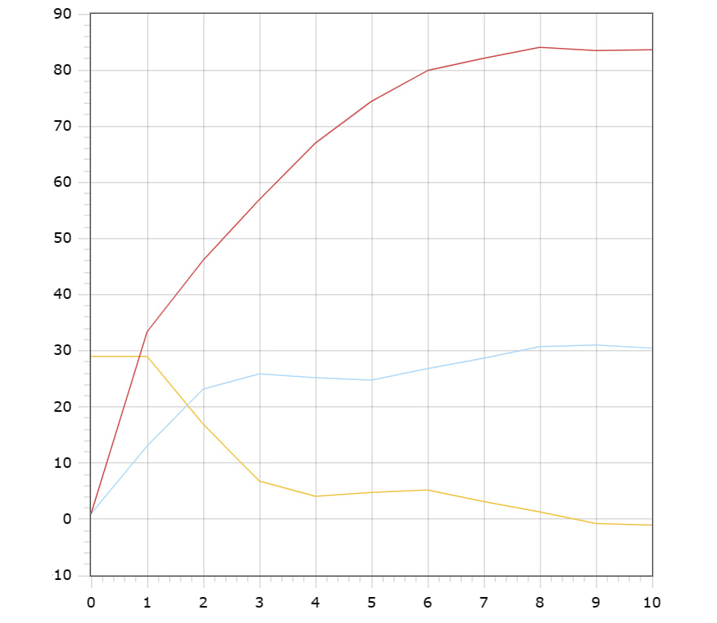

<p align="center"> Министерство образования Республики Беларусь</p>
<p align="center">Учреждение образования</p>
<p align="center">“Брестский Государственный технический университет”</p>
<p align="center">Кафедра ИИТ</p>
<br><br><br><br><br><br><br>
<p align="center">Лабораторная работа №2</p>
<p align="center">По дисциплине “Общая теория интеллектуальных систем”</p>
<p align="center">Тема: “ПИД-регуляторы”</p>
<br><br><br><br><br>
<p align="right">Выполнила:</p>
<p align="right">Студентка 2 курса</p>
<p align="right">Группы ИИ-23</p>
<p align="right">Тутина Е. Д.</p>
<p align="right">Проверил:</p>
<p align="right">Иванюк Д. С.</p>
<br><br><br><br><br>
<p align="center">Брест 2023</p>

---

# Общее задание #
1. Написать отчет по выполненной лабораторной работе №1 в .md формате (readme.md) и с помощью запроса на внесение изменений (**pull request**) разместить его в следующем каталоге: **trunk\ii0xxyy\task_01\doc** (где **xx** - номер группы, **yy** - номер студента, например **ii02302**).
2. Исходный код написанной программы разместить в каталоге: **trunk\ii0xxyy\task_01\src**.

# Задание #
На C++ реализовать программу, моделирующую рассмотренный выше ПИД-регулятор.  В качестве объекта управления использовать математическую модель, полученную в предыдущей работе.
В отчете также привести графики для разных заданий температуры объекта, пояснить полученные результаты.
---

# Выполнение задания #

Код программы:
```C++
#include <iostream>
#include <cmath>
#include <fstream>
#include < iomanip>

using namespace std;

struct PID {
	
	double y0;
	double y1;

	double e0;
	double e1;
	double e2;

	double u0;
	double u1;

	void next_val(double& x0, double& x1, double next) 
	{
		x0 = x1;
		x1 = next;
	}

	void next_val1(double& x0, double& x1, double& x2, double next) 
	{
		x0 = x1;
		x1 = x2;
		x2 = next;
	}

	double K = 0.9;
	double T = 1.1;
	double TD = 1.01;
	double T0 = 1.34;

	double funk0(double K, double TD, double T0) 
	{
		double q0 = K * (1 + TD / T0);
		return q0;

	}

	double funk1(double K, double TD, double T0,double T)
	{
		double q1 = -K * (1 + 2 * TD / T0 - T0 / T);		
		return q1;

	}

	double funk2(double K, double TD, double T0)
	{

		double q2 = K * TD / T0;
		return q2;
	}	
		
	void function_cout(double val_y1, double val_y0)
	{
		double A = 0.5, B = 0.5, C = 0.35, D = 1.1, U = 4.1, W = 30;;
		int i = 0;
		y0 = val_y0;
		y1 = val_y1;
		e0 = 0;
		e1 = W - val_y0;
		e2 = W - val_y1;
		u0 = 1;
		u1 = 1;

		cout << "Function E is " << setw(25) << "Function Y is " << setw(28) << "Function U is" << endl;

		while (abs(W - y1) > 0.01)
		{
			cout << i << " ";
			printf("%.4f", e2);
			cout << setw(20);
			next_val1(e0, e1, e2, W - y1);
			U = u1 + funk0(K, TD, T0) * e2 + funk1(K, TD, T0, T) * e1 + funk2(K, TD, T0) * e0;
			double next = A * y1 - B * y0 + C * U + D * sin(u1);
			cout << i << " ";
			printf("%.4f", y1);
			cout << setw(20);
			next_val(y0, y1, next);
			cout << i << " ";
			printf("%.4f", u1);
			cout << endl;
			next_val(u0, u1, U);
			i++;

		}
	}
	
	

};

int main()
{
	double val_y1 = 1;
	double val_y0 = 0.1;

	PID func; 
	func.function_cout(val_y1, val_y0); 
	
	return 0;
}

```     

Вывод программы:

Function E is            Function Y is                Function U is
0 29.0000                   0 1.0000                   0 1.0000
1 29.0000                   1 13.0674                   1 33.4051
2 16.9326                   2 23.1924                   2 46.1529
3 6.8076                   3 25.8933                   3 56.9224
4 4.1067                   4 25.1991                   4 66.9914
5 4.8009                   5 24.7644                   5 74.4218
6 5.2356                   6 26.8365                   6 79.9005
7 3.1635                   7 28.6866                   7 82.0753
8 1.3134                   8 30.7574                   8 84.0291
9 -0.7574                   9 31.0293                   9 83.4557
10 -1.0293                  10 30.4736                  10 83.6009


   

